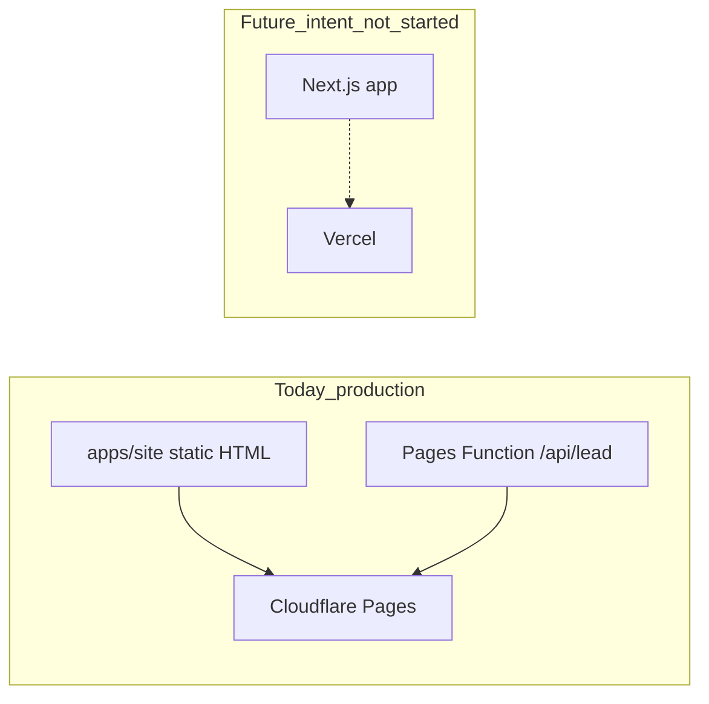

# Cursor Agent Layout (Progressive Disclosure) - Plan

**Date:** 2026-07-14  
**Scope choice:** Agent layout only — keep live Cloudflare static site as production; no Next.js scaffold in this pass.  
**References:** [aihero AGENTS.md guide](https://www.aihero.dev/a-complete-guide-to-agents-md), existing Paradise client-site docs on PR #2 branch.

```yaml
artifact_contract: ce-unified-plan/v1
artifact_readiness: implementation-ready
product_contract_source: user + setup-review
```

## Goal Capsule

Make the Paradise Spas monorepo **Cursor-smooth**: slim root `AGENTS.md`, progressive disclosure into docs/rules/skills, clean placements, optional Next/Vercel **future intent documented** without migrating the live site.

**Out of scope this pass:** Next.js app, Vercel project, Convex backend, HTML/JS site rewrites, Cloudflare deploy script changes.

---

## Product Contract

### Objective

Agents load a small always-on instruction budget and discover deeper guidance on demand. Humans keep a clear ops docs tree. Production remains `apps/site` on Cloudflare Pages.

### Requirements

- **R1.** Root `AGENTS.md` is minimal: one-line product identity, monorepo open-at-root, essential commands, pointers to progressive docs — not a ball of mud.
- **R2.** Domain guidance lives under `docs/agent/` (or `docs/`) with clear names; root AGENTS links to them conversationally.
- **R3.** Always-on `.cursor/rules` stay short and non-duplicative of AGENTS; globbed rules keep site/functions/tracking specifics.
- **R4.** Skills stay thin workflow recipes that point at docs; merge obvious overlaps (`deploy-preview` → fold into `production-deploy-checklist`).
- **R5.** Nested `AGENTS.md` in `apps/site`, `apps/dashboard`, `packages/agency-starter` stay capability-focused (no deep file-path inventories).
- **R6.** Document **target** stack (Next.js + Vercel) as future intent only; document **current** stack as Cloudflare static + Pages Functions — agents must not invent Next work for routine tasks.
- **R7.** Historical plans/research and cross-project notes are archived or labeled so they do not compete with ops docs.
- **R8.** No app code, Wrangler, or `.env.local` changes.

### Success criteria

- Root `AGENTS.md` roughly ≤ ~60–80 lines and instruction-budget friendly.
- Agent can answer “how do I update inventory / deploy / lead API?” by following links without stuffing all detail into root AGENTS.
- Opening the repo at root still works; `npm run check:structure` / `verify:deploy` still pass.
- Future Next/Vercel work has an explicit pointer doc so a later phase does not reinvent layout.

---

## Target layout (Cursor-expert, progressive disclosure)

```text
/
├── AGENTS.md                          # MINIMAL — always loaded
├── README.md                          # Humans — pointer index
├── CLAUDE.md -> AGENTS.md             # optional symlink for Claude Code
├── .cursor/
│   ├── rules/
│   │   ├── 00-project-overview.mdc    # thin alwaysApply (points to AGENTS + docs)
│   │   ├── 10-static-html-site.mdc    # glob apps/site HTML/CSS/JS
│   │   ├── 20-pages-functions.mdc     # glob functions
│   │   ├── 30-tracking-and-leads.mdc
│   │   ├── 40-git-and-prs.mdc
│   │   └── 50-research-exa.mdc        # external research only
│   ├── skills/                        # on-demand workflows only
│   ├── mcp.json.example
│   └── environment.json
├── apps/
│   ├── site/AGENTS.md                 # package: live Pages project
│   ├── dashboard/AGENTS.md            # package: SOPs only
│   └── …                              # unchanged runtime tree
├── packages/agency-starter/AGENTS.md
├── docs/
│   ├── agent/                         # progressive disclosure for agents
│   │   ├── README.md                  # index of agent docs
│   │   ├── STACK.md                   # current vs future (Next/Vercel intent)
│   │   ├── NAVIGATION.md              # how to find packages/capabilities
│   │   └── CONVENTIONS.md             # git, secrets, PR (if not only in rule)
│   ├── ops/                           # human/agent ops (move from docs root)
│   │   ├── ARCHITECTURE.md
│   │   ├── DEPLOYMENT.md
│   │   ├── ENVIRONMENT.md
│   │   ├── CLIENT-OPERATIONS.md
│   │   ├── INVENTORY-UPDATE.md
│   │   ├── QA-CHECKLIST.md
│   │   └── LEAD-RECOVERY.md
│   ├── tooling/                       # MCP / Cursor machine setup
│   │   ├── MCP-VITAL-SETUP.md
│   │   ├── CLOUDFLARE-MCP-CONNECT.md
│   │   └── TASK-12-CURSOR-CLOUDFLARE-SETUP.md (or merge into one TOOLING.md)
│   ├── PLAYBOOK.md                    # strategy — load only when asked
│   ├── plans/                         # active/unified plans (this file lives here)
│   ├── archive/                       # historical + research dumps
│   │   ├── plans/                     # from docs/superpowers/plans/
│   │   └── research/
│   └── …
```

**Principle (aihero):** Root AGENTS = essentials + breadcrumbs. Rules = hard guardrails with globs. Skills = how to do a task. Docs = detailed truth.

---

## Implementation units

### U1. Slim root AGENTS.md

**Cites:** R1, R2, R6

Rewrite [AGENTS.md](AGENTS.md) to roughly:

1. One-sentence product description  
2. Open at repo root  
3. Current stack one-liner + pointer to `docs/agent/STACK.md`  
4. Layout bullets (capabilities, not every path)  
5. Essential commands  
6. Non-negotiables (5 bullets max)  
7. Link table: ops docs + skills indexes  

Remove duplicated MCP walkthroughs and long “where to look” walls (move to `docs/agent/NAVIGATION.md`).

### U2. Add `docs/agent/` progressive docs

**Cites:** R2, R6

Create:

- `docs/agent/README.md` — index  
- `docs/agent/STACK.md` — **Current:** Cloudflare Pages + Functions, vanilla HTML. **Future intent:** Next.js + Vercel (not started; do not scaffold). **Not now:** Convex SaaS.  
- `docs/agent/NAVIGATION.md` — where homepage / lead API / inventory / SOPs / agency kit live  

Update pointers from AGENTS and rules.

### U3. Reorganize `docs/` into ops / tooling / archive

**Cites:** R2, R7

- Move client ops markdowns into `docs/ops/` (or keep flat with a `docs/README.md` index if moves are too disruptive — **prefer moves + update links** for clarity).  
- Move MCP/Task-12 guides into `docs/tooling/`.  
- Move `docs/superpowers/plans/` → `docs/archive/plans/`.  
- Move `docs/research/` → `docs/archive/research/`.  
- Place this plan under `docs/plans/`.  
- Update all relative links in AGENTS, README, skills, rules.

**Default:** Prefer directory moves with link updates in the same PR over leaving a permanent flat dump.

### U4. Thin always-on rules; kill duplication

**Cites:** R3

- Shorten `.cursor/rules/00-project-overview.mdc` to: open root, read AGENTS, current vs future pointer — no long command lists.  
- Keep glob rules `10`/`20`/`30` as runtime guardrails.  
- Keep `40-git-and-prs` alwaysApply (small).  
- Keep `50-research-exa` alwaysApply but ensure it says “not for local site edits.”  
- Do **not** add Next.js alwaysApply rules.

### U5. Skills hygiene

**Cites:** R4

| Action | Skill |
|--------|--------|
| Keep | `update-inventory`, `client-content-update`, `tracking-id-change`, `form-qa`, `lead-reimport`, `seo-page-update`, `campaign-cleanup`, `lead-api-change`, `new-landing-page` |
| Merge | `deploy-preview` content into `production-deploy-checklist`; delete `deploy-preview` or make it a one-line alias pointing to the checklist |
| Keep secondary | `new-client-from-agency-starter` (other clients) |
| Do **not** add | Next.js / Vercel skills until a migration phase |

Ensure each skill starts with “Read docs/ops/…” (or new paths).

### U6. Nested AGENTS.md pass

**Cites:** R5

Tighten subdirectory AGENTS to 5–10 lines capability statements + link to `docs/agent/STACK.md` / relevant ops doc. No inventory of every HTML file.

### U7. Cleanup candidates (safe relocations)

**Cites:** R7

| Item | Action |
|------|--------|
| `apps/dashboard/POWERSPORTSLAUNCH_VIEWCONTENT.md` | Move to `docs/archive/` or `packages/agency-starter/docs/` |
| Agency SOP markdowns that are not Paradise-daily | Leave in dashboard for now **or** note in NAVIGATION as “agency kit adjacent” — avoid big dashboard churn unless links are updated |
| Demo pages (`inventory-gate-demo.html`, `chat-widget-test/`) | Do not delete live URLs in this pass — document under campaign-cleanup / QA only |
| Optional `CLAUDE.md` → symlink to `AGENTS.md` | Add if desired for Claude Code compatibility |

### U8. Verification

**Cites:** R8

- `npm run check:structure`  
- `npm run verify:deploy`  
- Grep for broken old paths (`docs/ARCHITECTURE.md`, `docs/superpowers/`) after moves  
- Confirm no `apps/site` runtime edits  

---

## Target STACK.md content (summary)



Agents must treat **today** as source of truth for routine work.

---

## Non-goals

- Scaffold `apps/web` or install Next.js  
- Switch hosting to Vercel  
- Rewrite lead API  
- Build Convex  
- Delete `packages/agency-starter`  
- Change Wrangler project name or deploy scripts  

---

## Suggested PR

- Branch: `cursor/agent-layout-progressive-disclosure-d10c` (from `master` after PR #2 merges, or stacked on docs cleanup if still open)  
- Title: `chore: progressive disclosure agent layout for client site`  
- Draft PR; humans merge  

---

## Implementation order

1. U2 create `docs/agent/*` and STACK.md (so links exist)  
2. U1 slim AGENTS.md  
3. U3 move docs + fix links  
4. U4 rules  
5. U5 skills  
6. U6 nested AGENTS  
7. U7 archive stragglers  
8. U8 verify  

---

## Open follow-ups (later phases — not this PR)

- Next.js + Vercel migration plan  
- Next skills + Vercel deploy skill  
- Demo/test page noindex or removal  
- Consolidate MCP guides into one `docs/tooling/README.md`  
